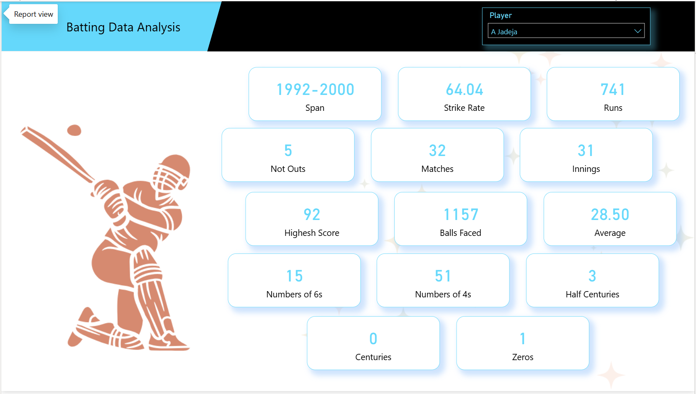
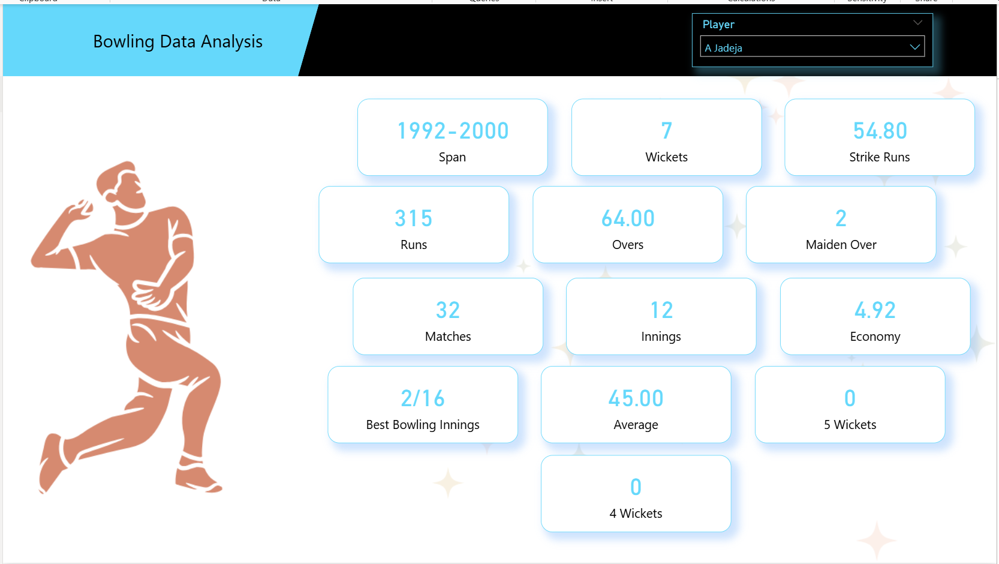
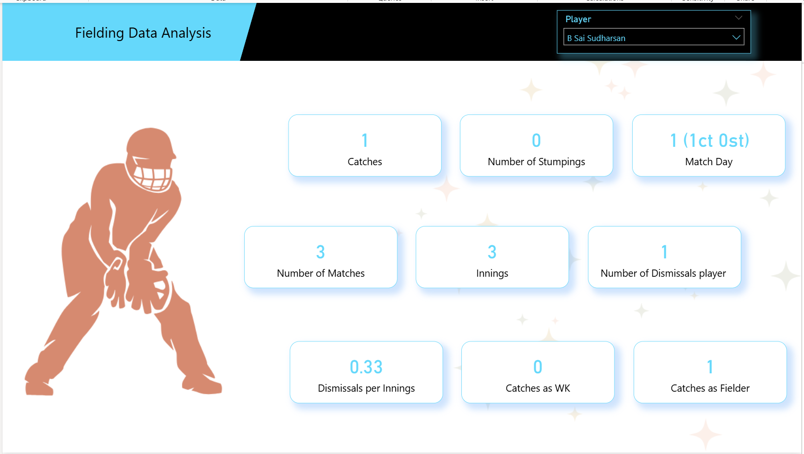

# 🏏 ESPN India vs South Africa - Player Performance Dashboard

This project is an interactive **Power BI Dashboard** that visualizes the performance of Indian and South African cricket players, highlighting their **Batting**, **Bowling**, and **Fielding** statistics across multiple matches and years.

## 📊 Project Overview

- **Title:** ESPN India vs South Africa Player Dashboard  
- **Scope:** Individual Player Stats (Batting, Bowling, Fielding)
- **Data Source:** Scraped from web (ESPN Cricinfo) using Power BI Web Connector
- **Tool Used:** Microsoft Power BI
- **Methodology:** Web Scraping → Data Cleaning → Data Transformation → Dashboard Design

## 🚀 Features

- 📅 **Career Span**: View player span from starting year to ending year  
- 🏏 **Batting Data**: Runs, Strike Rate, Matches, Innings, Not Outs, 4s, 6s, High Score, Half-Centuries  
- 🏐 **Bowling Data**: Wickets, Economy, Overs, Best Bowling, Average, 4W/5W hauls  
- 🧤 **Fielding Data**: Catches, Stumpings, Matchwise dismissals  
- 📌 **Player Selection Dropdown**: Quickly view stats for each player  
- ✨ **Clean and Modern UI** with icons and light visuals  

## 📂 Data Collection

- Collected through Power BI Web Scraping feature from ESPN Cricinfo
- Cleaned and structured using Power BI's Power Query Editor
- Created three main dashboards:
  1. **Batting Data Analysis**
  2. **Bowling Data Analysis**
  3. **Fielding Data Analysis**

## 🖼️ Dashboard Snapshots

### 1. Batting Data Analysis  

---

### 2. Bowling Data Analysis  

---

### 3. Fielding Data Analysis  

---

## 🛠️ Tools & Technologies

- **Power BI** – Data visualization & dashboard building  
- **Power Query** – Data transformation  
- **Web Scraping (Power BI Connector)** – Real-time data import  

## 💡 Learnings

- Practical experience in web scraping using Power BI  
- Advanced DAX & Power Query skills  
- Designing clean, interactive dashboards  
- Real-world performance tracking and comparison  

---

## 📌 Author

**Kirtish Wankhedkar**  

